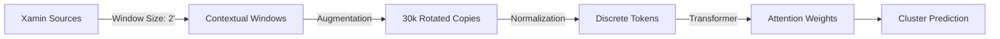

# **README - Detecting Galaxy Clusters with Transformer Networks**

## **Overview**

This project implements a Transformer-based neural network to analyze astronomical catalogs and detect galaxy clusters and Active Galactic Nuclei (AGN) from X-ray source data (Xamin). The system processes spatial data by creating contextual windows around sources, applying data augmentation techniques, and transforming the data into tokenized sequences suitable for Transformer models.

**Sequence Architecture**
```text
[CLS] | Xamin_params₁ | ... | Xamin_paramsₙ | [SEP_AMAS] | Cluster_flag | [SEP]
```

**Input:**

- Selected Xamin parameters (EXT_LIKE, PNT_DET_ML, positions relatives, etc.) for all sources within a 2 arcmin window

- Central source parameters + neighborhood context

- Special tokens delimit sections ([CLS], [SEP_AMAS], [SEP])

**Target:**
Binary flag indicating whether a galaxy cluster exists within SEARCH_RADIUS_CLUSTER (20 arcsec) of the window center.

**Key Innovations**

1. **Context-Aware Prediction**
The model leverages both:

- Parameters of the central X-ray source

- Neighboring sources' properties within the window to make cluster predictions.

2. **Spatial Encoding**
Relative positions (EXT_RA/DEC) are normalized to window-centric coordinates, preserving spatial relationships.

3. **Optimized Tokenization**
Continuous parameters → Discrete tokens (1024 bins + 5 special tokens) with log/linear scaling.


**Pipeline Technique**



## **Project Structure**

```text
Project_Transformer_FornaX/Transformer_Window_Center_Classifier/

├── src/
│   ├── Constantes.py            # Configuration parameters and constants
│   ├── Fct_tokenisation.py      # Core functions for data processing
│   ├── FiltrageDonneesEntree.py # Initial data filtering and correlation
│   ├── Tokenisation.py          # Data tokenization pipeline
│   ├── Model_XVI.py             # Transformer model implementation
│   ├── GeneratorSequence.py     # Sequence generation for predictions
│   └── submit_*.sh              # Job submission scripts for HPC
├── data/                        # Directory with the three base catalogs serving as the initial dataset
├── results/                     # Output directory for processed data and models
└── logs/                        # Log files from job executions
```
## **Key Features**

- Contextual Window Processing: Creates 2 arcmin² windows centered on X-ray sources

- Multi-catalog Integration: Combines data from X-ray sources (Xamin), galaxy clusters (AMAS), and AGN catalogs

- Data Augmentation: Applies random rotations (30,000 per window) and mirror transformations

- Optimized Processing: Uses chunked processing for memory efficiency (300 rotations per chunk)

- Custom Tokenization: Specialized sequence generation for astronomical data with 1024 value tokens + 5 special tokens

- Transformer Architecture: Implements an autoregressive Transformer model with 6 layers and 8 attention heads

## **Installation**
Prerequisites: dependencies listed in requirements.txt


Install dependencies: 
```bash
pip install -r requirements.txt
```

## **Data Preparation Pipeline**

1. Initial Data Filtering

Execute the initial data correlation and filtering:

```bash
sbatch submit_tokenisation.sh
```

This runs:

- `FiltrageDonneesEntree.py`: Performs spatial matching between input catalogs and Xamin data

- `Tokenisation.py`: Processes the matched data into tokenized sequences

2. Model Training
Train the Transformer model:
```bash
sbatch submit_training_ModelXVI.sh
```
3. Sequence Generation
Generate predictions:

```bash
sbatch submit_GenerateSequence.sh
```

## **Configuration**

Key parameters are defined in Constantes.py:

Catalog Selection

- `catalog_path_AMAS`: Path to galaxy clusters catalog

- `catalog_path_AGN`: Path to AGN catalog

- `catalog_path_aftXamin`: Path to X-ray source catalog

Matching Parameters

- `SEARCH_RADIUS_CLUSTER`: Matching radius for clusters (20 arcsec)

- `SEARCH_RADIUS_AGN`: Matching radius for AGN (10 arcsec)

- `LIM_FLUX_CLUSTER`: Minimum flux for clusters (1×10⁻¹⁵ erg/cm²/s)

- `LIM_FLUX_AGN`: Minimum flux for AGN (1×10⁻¹⁵ erg/cm²/s)

Window Parameters

- `NOMBRE_PHOTONS_MIN`: Minimum photon count threshold (100)

- `TOTAL_ROTATIONS`: Number of rotations per window (30,000)

- `CHUNK_SIZE`: Rotations processed per chunk (300)

- `WINDOW_SIZE_ARCMIN`: Window size (2 arcmin)

- `MAX_Xamin_PAR_FENESTRON`: Maximum sources per window (2)

Transformer Configuration

- `VOCAB_SIZE`: Token vocabulary size (1029)

- `D_MODEL`: Model dimension (256)

- `NUM_HEADS`: Number of attention heads (8)

- `NUM_LAYERS`: Number of transformer layers (6)

- `BATCH_SIZE`: Training batch size (32)

## **Data Processing Workflow**

**Initial Filtering:**

- Matches input catalogs with Xamin sources within specified radii

- Applies flux cuts to select significant sources

- Applies photon count cut (`NOMBRE_PHOTONS_MIN`=100)


- Splits data into training (Dec > 2.15°) and test sets: Splits data into training and test sets to keep approximately 80% of the data for training and 20% for testing the model.

**Data Processing Functions (Fct_tokenisation.py)**

- `CreateListID_Xamin()`: Creates combined ID lists with controlled proportions

- `Batisseuse2Fenetres()`: Builds windows around Xamin sources with recentered coordinates

- `GardeFenestronsSousPeuples()`: Filters windows to keep only those with limited sources

- `random_rotations_and_mirror()`: Applies optimized rotations/mirroring using Numba

- `process_rotations_in_chunks()`: Handles large-scale rotations in manageable chunks

- `discretise_et_complete()`: Normalizes and tokenizes data with padding

- `combine_and_flatten_with_special_tokens()`: Creates final token sequences

**Window Creation:**

- For each Xamin source, creates a square window

- Includes all Xamin sources, clusters, and AGN within the window

- Recenters coordinates to (0,0) at window center

**Data Augmentation:**

- Applies random rotations (30,000 per window)

- Adds mirror transformations

- Processes in chunks of 300 rotations for memory efficiency

**Tokenization:**

- Normalizes values using log/linear scaling

- Discretizes into 1024 integer tokens

- Adds special tokens (CLS, SEP, etc.)

- Pads sequences to fixed length

**Model Architecture**

The Transformer model (`Model_XVI.py`) features:

- Multi-head self-attention

- Layer normalization

- Positional embeddings

Autoregressive sequence generation

## **Output Files**

The pipeline generates:

- `X_train.txt`, `X_test.txt`: Tokenized sequences

- `constantes_du_modele.json`: Model configuration

- `global_stats_Xamin.json`: Normalization statistics

- Rotation chunks in `rotation_output_{train,test}/`

- Validation plots for discretization

## **Customization**
To modify the analysis:

Adjust parameters in `Constantes.py`

Update selected columns in:

- `SELECTED_COLUMNS_Xamin`

- `SELECTED_COLUMNS_input_clusters`

- `SELECTED_COLUMNS_input_AGN`

Correspondingly update the scaling flags:

- `use_log_scale_Xamin`

- `use_log_scale_input_clusters`

- `use_log_scale_input_AGN`

## Performance Notes

- Training requires GPU acceleration (A100 recommended)

- 30,000 rotations provides extensive augmentation

- Chunked processing enables handling large rotation counts

- Numba-optimized rotation calculations

## Future Work
- Incorporate galaxy catalog data

- Add photometric redshift information

- Implement multi-task learning for simultaneous cluster/AGN detection


The updated system provides more robust data augmentation through extensive rotations and improved memory handling via chunked processing, while maintaining the core Transformer architecture for sequence modeling.

## Contact

**Author**: Sylvain HEURTIER
**Email**: sylvain.heurtier@iap.fr